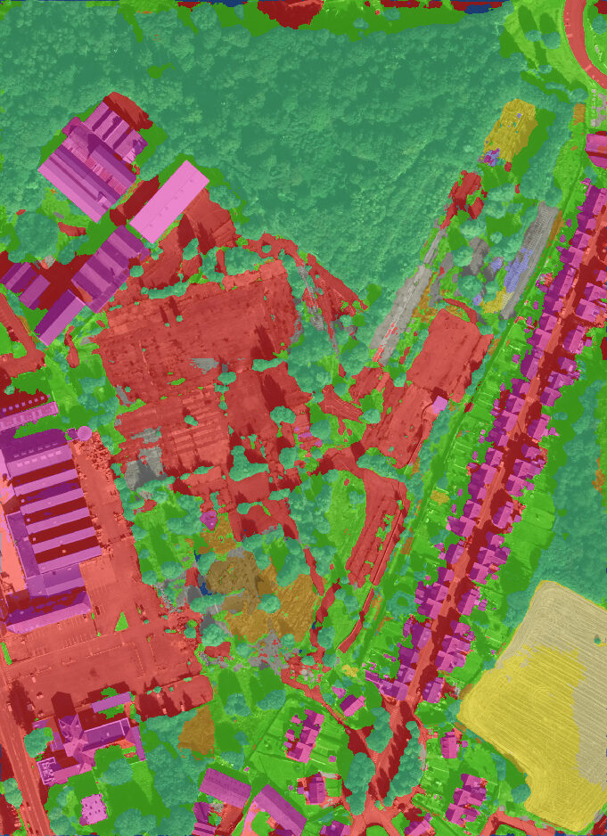

# Semantic Segmentation QGIS Plugin

A QGIS plugin for semantic segmentation using the FLAIR-1 model. It automates deep learning inference on raster layers directly from the QGIS interface and manages its own Python environment.

## Usage

To set up and use the plugin, simply follow the [User Guide](resources.py).

## Features and Modifications

This plugin was created using the [QGIS Plugin Builder](https://g-sherman.github.io/Qgis-Plugin-Builder/#concepts) and the models from [FLAIR-1](https://github.com/IGNF/FLAIR-1). To enable the use of deep learning algorithms directly within QGIS, a virtual Python environment is necessary. This environment is created with the [micromamba](https://mamba.readthedocs.io/en/latest/index.html) tool.

The main files are the following:  
- `semantic_segmentation.py`: The core of the plugin where all the implementation is done.
- `semantic_segmentation_dialog_base.ui`: The main user interface.
- `install_env.py`: The script to install the dependencies required to use the FLAIR-1 models.
- `install_dialog.ui`: The user interface for the dependencies installation. 

For more information, see the [PyQGIS Developer Cookbook](http://www.qgis.org/pyqgis-cookbook/index.html).

*(C) 2011-2018 GeoApt LLC - geoapt.com*